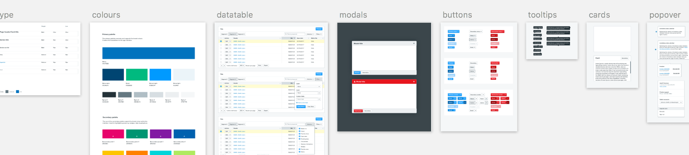
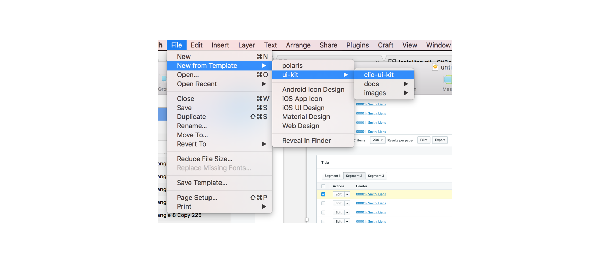
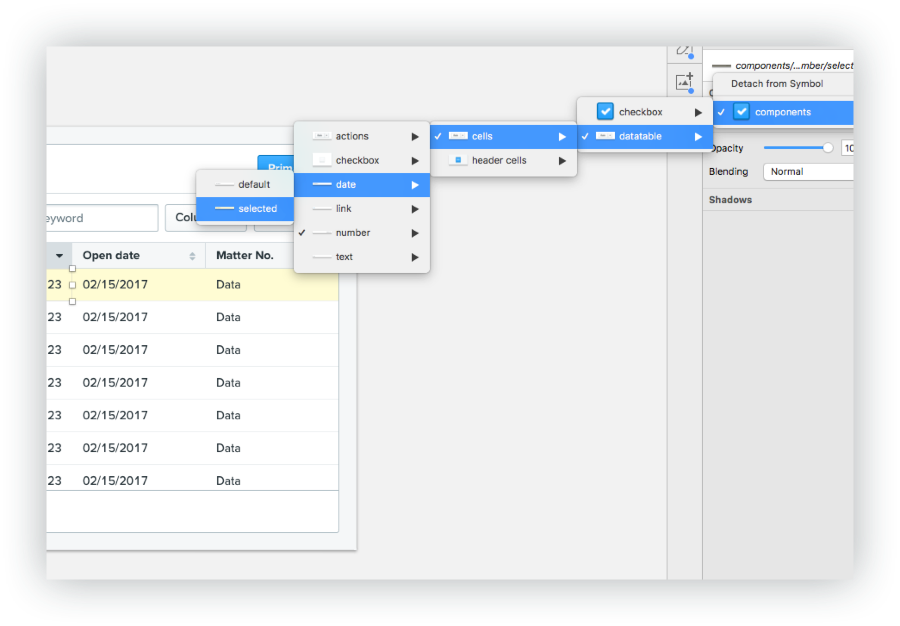

# Clio UI kit
The Clio UI Kit is a sketch file containing all the assets used to design product at Clio. It also contains documentation and design guidelines, and comes with commands for running and maintaining the files.



**Features**
* Symbol overrides
* Layer styles
* Create new projects, stay updated, and view documentation with a few simple commands.

## Command Quick Reference
2. `npm run new` Opens a copy of the ui kit and saves it to desktop.
1. `npm run docs` Runs documentation in a web browser
2. `npm run update` Updates to the latest version
2. `npm run source` Opens the original source .sketch file

## Dependencies
* Sketch app
* Git - [Installing Git](https://www.atlassian.com/git/tutorials/install-git)
* npm - [Installing npm](https://www.npmjs.com/get-npm)

## Installing
There are two ways to start using the UI kit. Installing via the command line is recommended - it will install directly into your sketch templates folder.

### Install as a sketch template (recommended)

Clone the repo into your sketch templates folder.
```
cd ~/Library/Application\ Support/com.bohemiancoding.sketch3/Templates/ && git clone git@github.com:gthierman/ui-kit.git && cd ui-kit
```
### Install to any directory
Clones the repository into a folder named 'ui-kit' in the current location
```
git clone git@github.com:gthierman/ui-kit.git && cd ui-kit
```

### Download the source

[Download a zip](https://github.com/gthierman/ui-kit/archive/master.zip) of the project.


## Start a new project
```
cd ui-kit
npm run new
```
This saves a copy of the ui kit named `untitled.sketch` to your desktop and opens sketch automatically. Rename and move it using the document title.


If you installed the UI kit as a sketch template, you can open a new project in `File > New from Template`


## Updating
Switch to the project directory and run
```
alias ui-kit = "~/Library/Application\ Support/com.bohemiancoding.sketch3/Templates/ui-kit"
cd ui-kit
npm run update
```
Run `npm run new` to open a fresh project containing the updates.

## Run the docs
The docs contain design guidelines and other instructions on how to use the UI kit.

 run
```
cd ui-kit
npm run docs
```
A browser window will open and the docs will appear after a few seconds.

<!-- ## Symbol overrides
 -->
