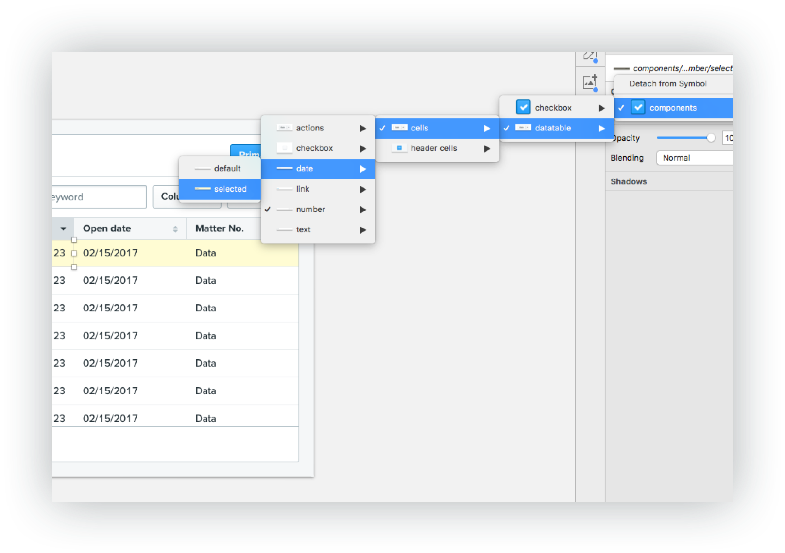

# Clio UI kit
The Clio UI Kit

## Dependencies
* Sketch app
* Git - [Installing gitbooks](https://www.atlassian.com/git/tutorials/install-git)
* Gitbook - run `npm install gitbook-cli -g` from the command line
* npm - [Installing npm](https://www.npmjs.com/get-npm)

#### Install with command line
This assumes you are setup on git.

Clone the repo into your sketch templates folder.
```
cd ~/Library/Application\ Support/com.bohemiancoding.sketch3/Templates/ && git clone git@github.com:gthierman/ui-kit.git && cd ui-kit
```
Open sketch and create a document using "New from template".

#### Download the source

Click the download zip link.

## Manage the UI Kit
1. `npm run docs` Gets the latest version of the UI kit
2. `npm run sketch` runs the documentation
2. `npm run update` Updates to the latest version

## Plugins
Links to essential plugins will go here.
#### Essential
* Relabel button

#### Useful
* Symbol organizer

## Symbol overrides

