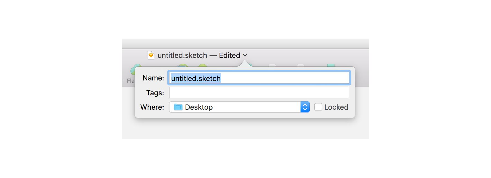

<!-- START doctoc generated TOC please keep comment here to allow auto update -->
<!-- DON'T EDIT THIS SECTION, INSTEAD RE-RUN doctoc TO UPDATE -->
**Table of Contents**

- [Clio UI kit](#clio-ui-kit)
  - [Quick Reference](#quick-reference)
  - [Dependencies](#dependencies)
  - [Installing](#installing)
    - [Install as a sketch template (recommended)](#install-as-a-sketch-template-recommended)
    - [Install to any directory](#install-to-any-directory)
    - [Download the source](#download-the-source)
  - [Start a new project](#start-a-new-project)
  - [Updating](#updating)
  - [Run the docs](#run-the-docs)

<!-- END doctoc generated TOC please keep comment here to allow auto update -->

# Clio UI kit
The Clio UI Kit is a sketch file containing all the assets used to design product at Clio. It also contains documentation and design guidelines, and comes with commands for running and maintaining the files.


**Features**
* Symbol overrides
* Layer styles
* Create new projects, stay updated, and view documentation with a few simple commands


## Quick Reference

### Commands

* `npm run new` saves a copy of `clio-ui-kit.sketch` named `untitled.sketch` to the desktop and opens the file.
* `npm run app-screens` Opens clio-app-screens.sketch.
* `npm run docs` Runs documentation in a web browser.
* `npm run update` Updates to the latest version.
* `npm run source` Opens the original source .sketch file.

### Sketch files

* `clio-ui-kit.sketch` Contains the symbol library and ui kit
* `clio-app-screens.sketch` Contains actual in-app screens from each area of the app.

## Dependencies
* Sketch app
* Git - [Installing Git](https://www.atlassian.com/git/tutorials/install-git)
* npm - [Installing npm](https://www.npmjs.com/get-npm)

## Installing
There are two ways to start using the UI kit. Installing via the command line is recommended - it will install directly into your sketch templates folder.

### Install as a sketch template

Clone the repo into your sketch templates folder.
```
cd ~/Library/Application\ Support/com.bohemiancoding.sketch3/Templates/ && git clone git@github.com:gthierman/ui-kit.git && cd ui-kit
```
### Install to any directory
Clones the repository into a folder named 'ui-kit' in the current location
```
git clone git@github.com:gthierman/ui-kit.git && cd ui-kit
```

### Download the source

[Download a zip](https://github.com/gthierman/ui-kit/archive/master.zip) of the project.


## Start a new project
```
cd ui-kit
npm run new
```
This saves a copy of the ui kit named `untitled.sketch` to your desktop and opens sketch automatically. Rename and move it using the document title.


If you installed the UI kit as a sketch template, you can open a new project in `File > New from Template`


## Updating
```
cd ui-kit
npm run update
```

<p style="color:#E41B28;">Updating will overwrite any changes made to the source file clio-ui-kit.sketch</p>

Run `npm run new` to open a fresh project containing the updates.

## Run the docs
```
cd ui-kit
npm run docs
```
The docs contain design guidelines and other instructions on how to use the UI kit. A browser window will open and the docs will appear after a few seconds.

<!-- ## Symbol overrides
 -->
