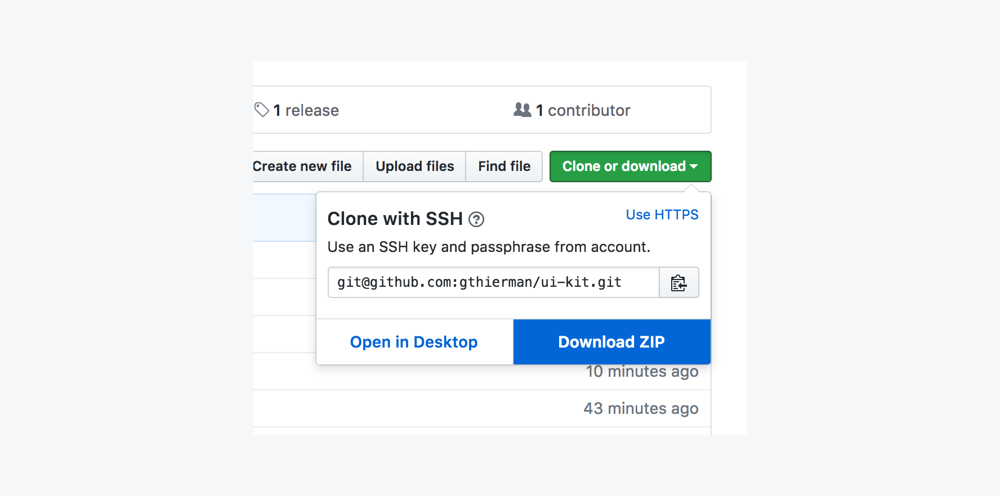

# Clio UI kit
The Clio UI Kit

## Command Quick Reference
1. `npm run docs` Runs documentation in a web browser
2. `npm run sketch` Opens the original source .sketch file
2. `npm run update` Updates to the latest version

## Dependencies
* Sketch app
* Git - [Installing Git](https://www.atlassian.com/git/tutorials/install-git)
* Gitbook - run `npm install gitbook-cli -g` from the command line
* npm - [Installing npm](https://www.npmjs.com/get-npm)

## Installing
There are two ways to start using the UI kit. Installing via the command line is recommended - it will install directly into your sketch templates folder.

### Install with command line (recommended)

Clone the repo into your sketch templates folder.
```
cd ~/Library/Application\ Support/com.bohemiancoding.sketch3/Templates/ && git clone git@github.com:gthierman/ui-kit.git && cd ui-kit
```
 Open sketch and create a document using "New from template", or run `npm run sketch` to open the source file.

### Download the source

Download the source in the "Clone or download" menu.
<!--  -->
<br>Open the file in sketch and save it as a template.<br>
Now create a document using "New from template".

## Updating
Run `cd ~/Library/Application\ Support/com.bohemiancoding.sketch3/Templates/ui-kit && npm run update` from the command line.

## Run the docs
Run `cd ~/Library/Application\ Support/com.bohemiancoding.sketch3/Templates/ui-kit && npm run docs` from the command line.

<!-- ## Symbol overrides
 -->
